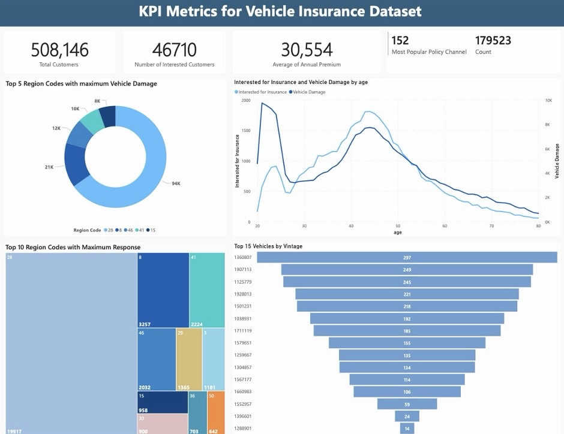

<h2 style="background-color:#e0f7fa; padding:08px; border-radius:8px;"> About Me</h2>

Hello Everyone! I am Sakshi, an experienced data engineer with a Master’s degree in Data Analytics from San Jose State University, specializing in transforming intricate data patterns into dynamic reports and dashboards to drive strategic business decisions.

My academic and professional journey reflects a commitment to excellence and a deep passion for data analytics and engineering. 

**Find my resume [here]({{ site.https://docs.google.com/document/d/1yP8CAwIZ_p0NB6HuXhPL1_TFiMR-Lf8O/edit?pli=1}})!**

<h2 style="background-color:#e0f7fa; padding:08px; border-radius:8px;"> Education</h2>

| Degree | Institution | Year | Relevant Coursework |
| ------ | ----------- | ---- | ------------------- |
| M.S in Data Analytics | San Jose State University, San Jose CA | Jan 2023 - Dec 2024 | Data Visualization, DB Systems, Machine Learning, Big Data Technologies, Deep Learning |
| B.E in Electronics and Telecommunication | Pune University, India | Aug 2017 - May 2021 | Computer Networks, Data Structures, Object Oriented Programming |

<h2 style="background-color:#e0f7fa; padding:08px; border-radius:8px;"> My Professional Journey</h2>

**Data Science Intern** 

| *Nuvento Inc. (Remote, US)* | March 2024 - Present
- At Nuvento Inc., I am currently channeling my analytical skills to transform educational outcomes. My primary responsibility is leveraging BI tools and SQL to architect a comprehensive edtech platform dashboard, offering schools the power to enact data-driven decisions via real-time student performance insights.

**ETL Developer, Data Analytics Pillar**

| *Schlumberger (Pune, India)* | Aug 2021 - Jan 2023
- I embarked on a data analytics expedition with Business Intelligence Studio at Schlumberger, steering through the intricate world of SQL, ETL, data modelings and data visualizations.
- With SQL as my compass and Power BI as my vessel, I navigated the creation of 50+ strategic  reports and dashboards, enhancing the organization's data-driven decision making by 40%.

**Business Development Executive Intern** 

| *Edview (Pune, India)* | Aug 2020 - Nov 2020
- At Edview, I was the bridge between innovative educational products and real-time customers.
- Through demonstrations and customer feedback, I iterated on MVPs, sharpening our product to perfection with each presentation.

<h2 style="background-color:#e0f7fa; padding:08px; border-radius:8px;"> Work Experience Highlights </h2>

- 🤝 **Team Collaborator:** At Schlumberger, I was the keystone in a multidisciplinary team, bridging gaps between departments with my adept coordination skills.

- 💬 **Communication Virtuoso:** Whether it was interpreting complex data into actionable insights or crafting requirement understanding documents, my communication skills were crucial. They allowed me to convey intricate KPIs in a manner that was concise, significantly enhancing decision-making processes.

- 🌐 **Networking Enthusiast:** My role at Schlumberger wasn't limited to technical prowess; rather I engaged with stakeholders across the board, from technical leads to business analysts, fostering a culture of knowledge sharing and collaborative problem-solving.

- 👁️‍🗨️ **UI/UX Enhancer:** My quest for excellence led to the refinement of Power BI dashboard interfaces to align with stringent UI/UX standards, which elevated user engagement by 30%, turning raw data into compelling data visualizations that tell a story.

- 🧩 **Problem Solver:** Faced with the challenge of inefficient data integration, I designed ETL pipelines that improved data processing and business intelligence capabilities, demonstrating my problem-solving prowess and my ability to turn data challenges into opportunities for growth.

<h2 style="background-color:#e0f7fa; padding:08px; border-radius:8px;"> Projects </h2>

**Phishing Website Detection**

_Challenge:_ Phishing attacks are a growing threat. Our mission was to devise a detection system that could spot these deceptive websites.

_Action:_ 
- Machine learning techniques were harnessed to preprocess a substantial dataset, where features indicative of phishing activities were engineered. 
- A logistic regression model was fine-tuned, focusing on precision and recall to detect subtle phishing indicators. Techniques such as cross-validation and grid search were employed to enhance the model's robustness against real-world phishing threats.
  
_Result:_ The model's false positive rates plummeted by 20%, sharpening the system's ability to shield users from online scams.

**Cloud Analytics and Data Warehouse Implementation**

  _Challenge:_ Traditional methods of predicting customer behavior were inadequate in the face of complex and voluminous data from various customer interactions with insurance products.
  
  _Action:_ 
 - Established a secure, scalable cloud-based data warehouse on AWS with a private VPC network and Amazon Redshift.
- Orchestrated ETL processes using Python scripts and Apache Airflow on Google Cloud Composer.
- Conducted in-depth SQL-based data analyses to identify customer behavior patterns and preferences.
- Extracted and visualized key performance metrics through Power BI and Tableau, enabling data-driven marketing strategies.

 
  _Result:_
  - Streamlined and organized the historical insurance data, allowing for advanced analytics.
  -  Provided valuable business intelligence that informed targeted marketing efforts, leading to enhanced customer engagement and potential growth areas identification.

**Customer Segmentation with Yelp Dataset**

_Challenge:_ Yelp's vast dataset awaited analysis to unveil customer segments.

_Action:_ 
- The setup of Apache Kafka facilitated the management of Yelp’s high-velocity data stream.
- A pipeline utilizing Spark Streaming processed the data in real-time, with Databricks serving as the platform for scalable data transformation scripts. Clustering algorithms were applied to segment customer data, involving rigorous feature engineering and hyperparameter tuning to optimize the segmentation model.

_Result:_ Segmentation speed surged by 25%, assisting in a new era of targeted marketing strategies.

- **ChatGPT Twitter Analysis**
  
  _Challenge:_ Unveiling trends in the rapidly growing domain of conversational AI.
  
  _Action:_
  - Twitter data was processed using MySQL queries and stored procedures to normalize and organize it into a star schema, enhancing query efficiency.
  - Dynamic dashboards were developed in Power BI, featuring slicers and filters for interactive data exploration. Visualizations were designed to elucidate ChatGPT’s growth trends, using Power BI’s data modeling features to extract and present key insights.
    
  _Result:_ Gained an enhanced understanding of KPIs and reporting efficiency.

<h2 style="background-color:#e0f7fa; padding:08px; border-radius:8px;"> Off the Grid: My World Beyond Data!</h2>

Beyond the world of data and analytics, I find rhythm and expression in the art of dance. 
As a devotee of Indian classical and contemporary dance forms, I've enjoyed the discipline and creativity that comes with it.

When not immersed in world of data, I turn to the serene world of watercolors. Each brushstroke on the canvas is a journey of color and emotion, a quiet to the structured thinking my professional life demands. This is one of my favorite paintings I made till date 😁

The thrill of trying new things led me to the ice rink, where I've discovered the joy of ice skating. It’s a challenging yet exhilarating experience that teaches me about balance and the importance of stepping out of my comfort zone. It reminds me that to keep moving forward, sometimes you have to glide on thin ice! :)

<h2 style="background-color:#e0f7fa; padding:8px; border-radius:8px;"> 🔗 Connect with me </h2>

- **LinkedIn:** [sakshimukkirwar](https://www.linkedin.com/in/sakshimukkirwar)
- **GitHub:** [sakshimukkirwar](https://github.com/sakshimukkirwar)
